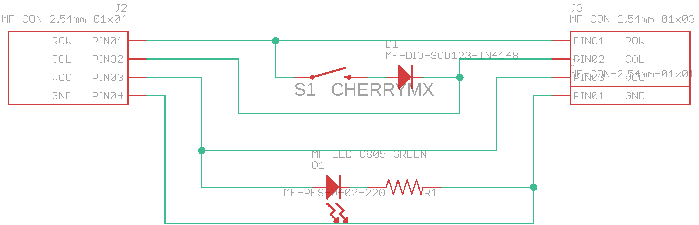

# switch-backpack
A small board that makes it easy to tidily wire a homemade keyboard

I wanted to experiment with a variety of keyswitch layouts using the same switches, and didn't want to have flying diode leads everywhere.

